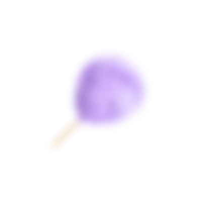
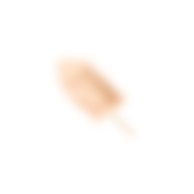
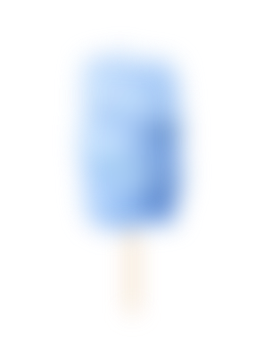
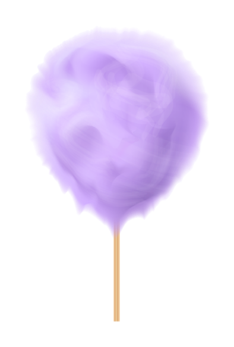
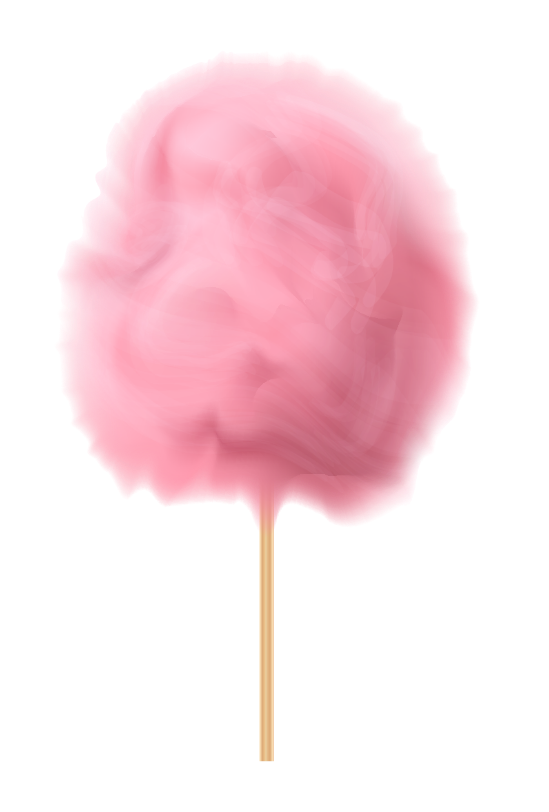
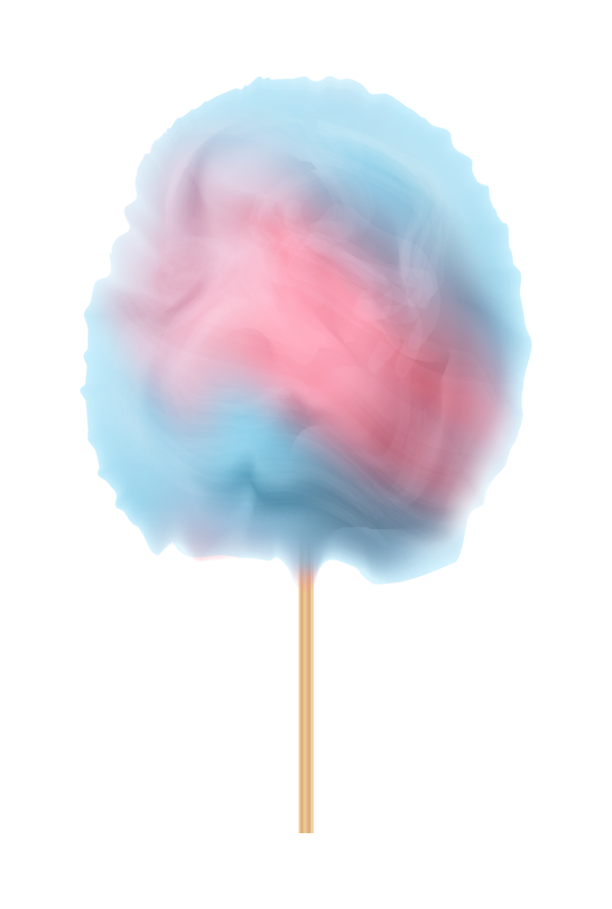
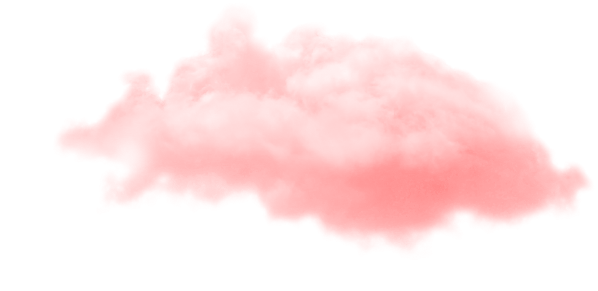


<!DOCTYPE html>
<html lang="en">
<head>
    <meta charset="UTF-8">
    <meta name="viewport" content="width=device-width, initial-scale=1.0">
    <title>💗</title>
    
</head>
<body>
    

        
        <h3>My Girl JiaHua</h3>
      

      

      

        

          <h3 class="rellax" data-rellax-speed="6">Gentle & Pretty</h3>
          <h1 class="rellax" data-rellax-speed="5">My Girl JiaHua</h1>
          

                we've been together
          

        

        
        
        
        
        
        
        
        
      

      

        

          <h3 >纪念</h3>
          <h1>4年3月5天</h1>
          

            2018.07.14——2022.10.29
          

        

        
        
      

      

      
      
</body>
</html>

